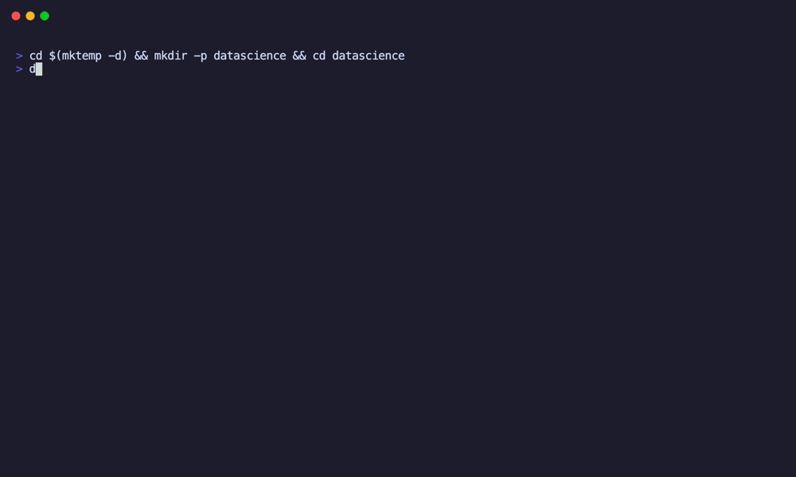

# dcc — Devcontainer Companion

A terminal UI for creating and configuring [devcontainers](https://containers.dev). Pick templates, toggle features, search extensions — all from one dashboard. No more hand-editing JSON.



---

## What it does

`dcc` gives you a persistent hub where you configure your devcontainer step by step:

- **Templates** — Browse the full [containers.dev](https://containers.dev/templates) catalog, fuzzy-search, preview README, configure options
- **Features** — Same for [features](https://containers.dev/features) — add Docker-in-Docker, Node, Python, etc. with per-feature options
- **VS Code Extensions** — Search the Marketplace, toggle extensions on/off
- **JetBrains Plugins** — Search the JetBrains Plugin Repository
- **Settings** — Edit remoteUser, ports, lifecycle commands, env vars, mounts
- **Build** — Test-build your devcontainer without leaving the hub (auto-rebuilds with `--no-cache` when config changed)
- **Open in VS Code** — Launch directly into the devcontainer

The right panel always shows your current `devcontainer.json` with syntax highlighting, so you see every change immediately.

## Install

### devcontainer CLI

`dcc` requires the devcontainer CLI for template apply, build, and open:

- **Via VS Code** (strongly recommended): `Cmd+Shift+P` → "Dev Containers: Install devcontainer CLI"
- **Via npm**: `npm install -g @devcontainers/cli` (Build only, no Open)

The VS Code variant is strongly recommended — it supports all features including `open` (launch directly into the devcontainer) and `templates apply`. The npm variant only supports Build. `dcc` detects which variant is installed and shows/hides menu items accordingly.

### dcc

**From source** (requires Go 1.22+):

```sh
go install github.com/mochlast/devcontainer-companion@latest
```

**Or build locally:**

```sh
git clone https://github.com/mochlast/devcontainer-companion.git
cd devcontainer-companion
make install
```

This installs the `dcc` binary to your `$GOPATH/bin`.

## Usage

```sh
# Open hub for current directory
dcc

# Open hub for a specific project
dcc -w ~/projects/my-app

# Bypass catalog cache (re-fetch templates/features)
dcc --no-cache
```

That's it. `dcc` creates `.devcontainer/devcontainer.json` if it doesn't exist and opens the hub.

### Keyboard shortcuts

The hub menu supports both arrow navigation and single-key shortcuts:

| Key | Action |
|-----|--------|
| `t` | Set Template |
| `f` | Add/Remove Features |
| `e` | VS Code Extensions |
| `j` | JetBrains Plugins |
| `c` | Edit Settings |
| `b` | Build |
| `o` | Open in VS Code |
| `q` | Exit |

Inside pickers, type to fuzzy-search. Press `?` to preview the README of a template or feature.

## License

[MIT](LICENSE)
